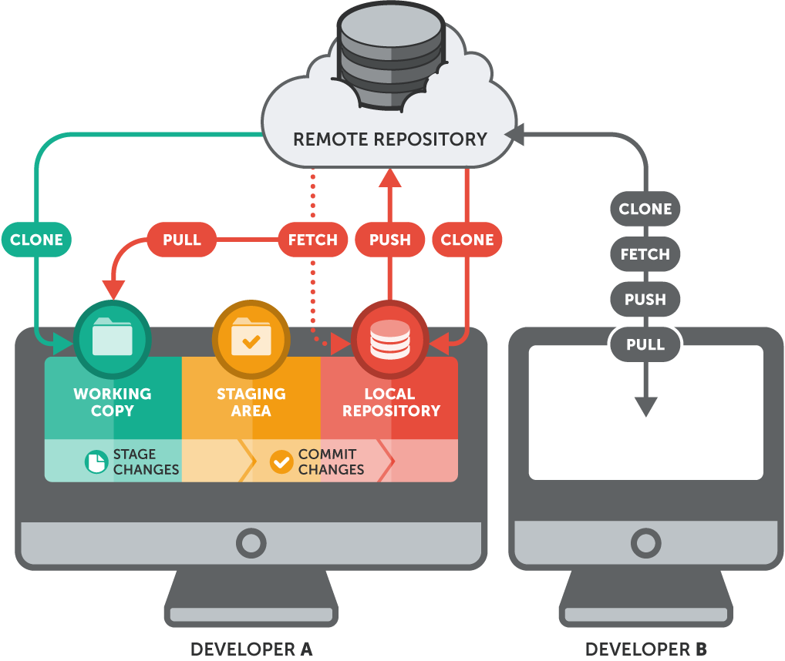

# 🛠️ Instalação e Configuração do Git

## 📥 Onde Baixar o Git

O Git é um sistema compatível com diversas plataformas. Para instalar, acesse o site oficial:  
🔗 [https://git-scm.com/downloads](https://git-scm.com/downloads)

### ✅ Windows
1. Baixe o instalador `.exe`.
2. Execute e siga as instruções padrão de instalação.
3. Durante a instalação, mantenha as opções padrão recomendadas.

### ✅ Linux
No terminal, execute o seguinte comando:

``bash
sudo apt-get update
sudo apt-get install git

Outras distribuições podem usar:

yum install git (RedHat/CentOS)
dnf install git (Fedora)

### ✅ MacOS
1. Instale o Homebrew se ainda não tiver:
/bin/bash -c "$(curl -fsSL https://raw.githubusercontent.com/Homebrew/install/HEAD/install.sh)"
2. Depois execute:
brew install git

## 🧰 Configurações Iniciais
Após a instalação, é necessário configurar o Git com suas informações de usuário.
Esses dados aparecem nos commits que você fizer.

### 1. ✅ Configurar Nome de Usuário:
git config --global user.name "Seu Nome"

### 2. ✅ Configurar E-mail:
git config --global user.email "seuemail@exemplo.com"

📝 Importante: Utilize o mesmo e-mail associado à sua conta do GitHub para facilitar o reconhecimento.

### 3. ✅ Verificar Configurações:
git config --list
Esse comando exibe todas as configurações definidas.

### 4. ✅ Checagem da Instalação
Para verificar se o Git foi instalado corretamente, execute:
git --version

Se estiver tudo certo, o terminal mostrará a versão atual do Git instalada, por exemplo:
git version 2.42.0

## 🖼️ Imagem Ilustrativa

## 🚨 Observações Importantes

Sempre mantenha o Git atualizado para ter acesso aos últimos recursos e correções de segurança.

As configurações com --global se aplicam a todos os repositórios locais no seu sistema.

Para configurações específicas de um repositório, utilize a opção --local:

git config --local user.name "Seu Nome".
git config --local user.email "seuemail@exemplo.com".